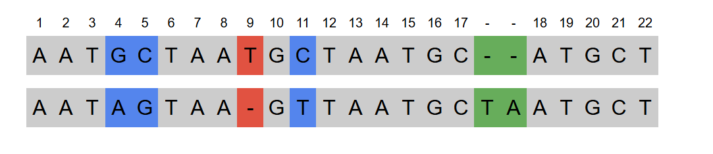

# GenAnalyzer

## Overview

GenAnalyzer is a web application developed using Flask, designed to simplify the analysis of protein sequences, identify mutations, and explore their potential links to genetic diseases. By integrating data from multiple sources, the application allows users to efficiently compare sequences with reference variants, making complex bioinformatics tasks more accessible.

The web application was developed as a graduate project and is available at [GenAnalyzer](https://genanalyzer.pythonanywhere.com/).

### Protein Analyzer 🧬

This tool allows users to compare a protein sequence against its reference sequence, detect mutations, and investigate their associations with human diseases.

### Advanced Sequence Aligner

This tool provides a deeper exploration of sequence alignment, offering a visual representation of how sequences are aligned. It utilizes the `Bio.Align.PairwiseAligner` class from the Biopython library to perform sequence alignment, giving the user control over the alignment process.

### Demo Video

Check out the demo of GenAnalyzer [here](https://www.youtube.com/watch?v=S4j5MqxXcqM).

## Contact

If you have any questions, suggestions, or feedback, feel free to reach out:

- Email: [genanalyzer24@gmail.com](mailto:genanalyzer24@gmail.com)
- GitHub Discussions: [GenAnalyzer Discussions](https://github.com/jajik123/GenAnalyzer/discussions)

## Installation

To run the GenAnalyzer web application locally, follow these steps:

1. Clone the repository: `git clone https://github.com/jajik123/GenAnalyzer.git`
2. Open the GenAnalyzer folder: `cd GenAnalyzer`
3. Create virtual environment using the venv module:
   `py -3.11 -m venv .venv`
   `.venv\Scripts\activate`
   
4. Install the dependencies: `pip install -r requirements.txt`
5. Run the application: `python run.py`
6. Open your web browser and go to `http://127.0.0.1:5000` to access the web application.

## Acknowledgements
- **Flask**: The web framework used to build and serve the GenAnalyzer application, allowing for seamless handling of requests and rendering of HTML pages.
- **Biopython**: A powerful toolkit for bioinformatics used for the sequence alignment.
- **UniProt**: A comprehensive protein sequence database, which serves as the reference source for protein data in GenAnalyzer.
- **ClinVar**: A public resource containing information about the relationships between genetic variations and human health, helping to link mutations to potential diseases.

